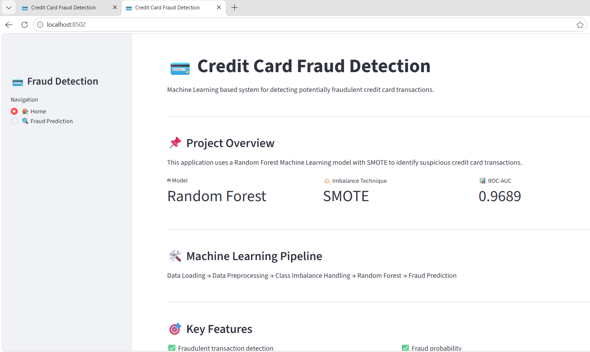
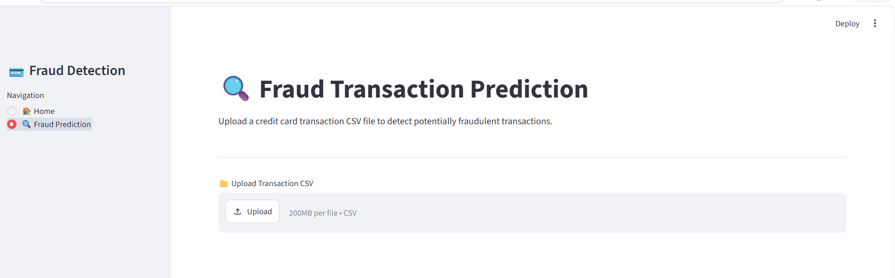
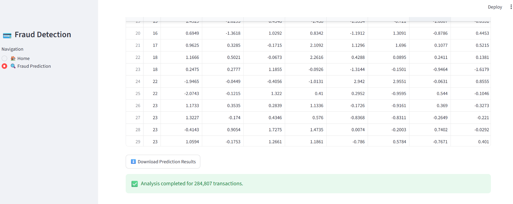

# 💳 Credit Card Fraud Detection

A Machine Learning based web application for detecting potentially fraudulent credit card transactions using **Random Forest** and **SMOTE**.

## 🚀 Live Application

🔗 **Streamlit App:** Add your deployed Streamlit URL here

---

## 📌 Project Overview

Credit card fraud is a major challenge in digital financial transactions. This project uses Machine Learning to identify suspicious transactions from credit card transaction data.

The application allows users to upload a transaction CSV file and automatically analyzes the transactions to identify potentially fraudulent activities.

---

## 🎯 Objectives

- Detect fraudulent credit card transactions
- Handle highly imbalanced transaction data
- Apply SMOTE for class imbalance handling
- Train a Random Forest classification model
- Provide fraud prediction through a Streamlit web application
- Display prediction results in an easy-to-understand format

---

## 🛠️ Technologies Used

- Python
- Pandas
- NumPy
- Scikit-learn
- Imbalanced-learn
- Joblib
- Streamlit
- Matplotlib

---

## 🤖 Machine Learning Model

### Random Forest

The project uses a **Random Forest Classifier** for fraud detection.

### Class Imbalance Handling

Credit card fraud datasets are highly imbalanced because legitimate transactions are much more common than fraudulent transactions.

To address this problem, **SMOTE (Synthetic Minority Over-sampling Technique)** is used to improve the model's ability to identify fraudulent transactions.

---

## 🔄 Machine Learning Pipeline

```text
Transaction Dataset
        ↓
Data Loading
        ↓
Data Preprocessing
        ↓
Class Imbalance Handling
        ↓
SMOTE
        ↓
Random Forest
        ↓
Fraud Prediction
        ↓
Prediction Results
```

---

## 📊 Model Performance

| Metric | Score |
|---|---:|
| ROC-AUC | **0.9689** |
| Fraud Precision | **0.84** |
| Fraud Recall | **0.83** |
| Fraud F1-Score | **0.83** |

The model achieved a **ROC-AUC score of 0.9689**, indicating strong performance in distinguishing legitimate and fraudulent transactions.

---

## 💻 Streamlit Application

### 🏠 Home Page

The Home page provides an overview of the fraud detection system, machine learning model, SMOTE technique, ROC-AUC score, and machine learning pipeline.



---

### 🔍 Fraud Transaction Prediction

Users can upload a transaction CSV file to detect potentially fraudulent transactions.



---

### 📊 Prediction Results

The application displays the uploaded transaction data and the corresponding prediction results.


---

### 📈 Analysis

The application provides transaction analysis and visualization to help understand the uploaded transaction data.



---

## 📂 Project Structure

```text
credit-card-fraud-detection/
│
├── app.py
├── main.py
├── creditcard.csv
├── requirements.txt
├── README.md
│
├── models/
│   └── fraud_detection_model.pkl
│
└── src/
    ├── model.py
    ├── preprocessing.py
    ├── predict.py
    └── train_model.py
```

---

## ⚙️ Installation

### 1. Clone the Repository

```bash
git clone https://github.com/priyadharshini2002-source/credit-card-fraud-detection.git
```

### 2. Navigate to the Project Directory

```bash
cd credit-card-fraud-detection
```

### 3. Install Dependencies

```bash
pip install -r requirements.txt
```

---

## ▶️ Run the Application

Run the Streamlit application:

```bash
streamlit run app.py
```

The application will open in your web browser.

---

## 📁 Dataset

The project uses the **Credit Card Fraud Detection Dataset**, containing legitimate and fraudulent credit card transactions.

### Dataset Features

- `Time`
- `V1` – `V28`
- `Amount`
- `Class`

### Target Variable

```text
0 → Legitimate Transaction
1 → Fraudulent Transaction
```

---

## 🔐 Fraud Detection Output

The application classifies transactions as:

```text
Legitimate Transaction
```

or

```text
Potentially Fraudulent Transaction
```

The application also provides prediction results for uploaded transaction data.

---

## 🌟 Key Features

- ✅ Machine Learning based fraud detection
- ✅ Random Forest classification
- ✅ SMOTE for class imbalance
- ✅ CSV file upload
- ✅ Batch transaction prediction
- ✅ Prediction results visualization
- ✅ ROC-AUC evaluation
- ✅ Interactive Streamlit interface

---

## 🔮 Future Enhancements

- Real-time transaction monitoring
- Fraud probability visualization
- Advanced anomaly detection
- XGBoost and LightGBM model comparison
- Real-time API integration
- Cloud deployment
- Explainable AI using SHAP

---

## 👩‍💻 Author

**S. Priyadharshini**

MSc Data Science

---

## 📜 License

This project is developed for educational and portfolio purposes.
